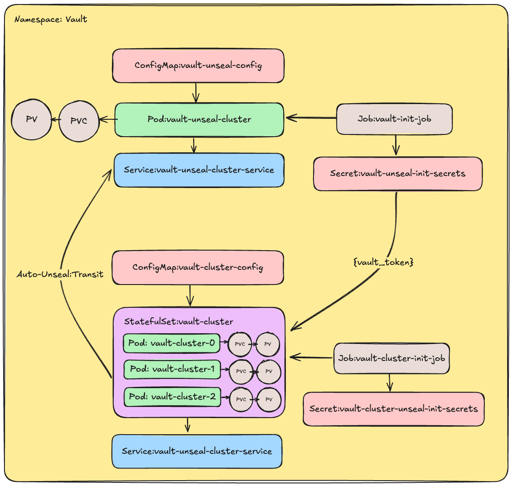

# Vault Example Load Testing

This guide demonstrates how to use Locust.io to load test Vault in a Kubernetes environment. The example uses Vault Enterprise, but you can switch to the OSS version by changing the image in `3-ClusterStatefulSet.yaml`.


## Running Vault in Kubernetes

This guide provides a comprehensive setup for deploying a highly available Vault cluster in Kubernetes using StatefulSets. This was used over helm more out of interest, using [Helm](https://developer.hashicorp.com/vault/docs/platform/k8s/helm) is the recomended approach. The setup includes:

- **Three-Node Vault Cluster**: Ensures high availability and fault tolerance for your Vault deployment.
- **StatefulSets**: Utilizes Kubernetes StatefulSets to manage the deployment and scaling of Vault instances with persistent storage.
- **Automatic Unsealing**: Configured with Vault’s auto-unseal feature for simplified secure operations without manual intervention.
- **Load Testing**: Designed with load testing in mind, this setup prioritises test environments over persistent storage. It is optimized for running tests and is not intended for long-term data persistence other then outage simulation. 
- **Monitoring**: Equipped with Prometheus and Grafana for real-time monitoring and visualization of Vault metrics and health.

This setup is designed to provide a robust environment for both development and production scenarios with one click, offering a scalable and monitored Vault deployment with built-in resilience.

3 jobs run to setup the vaults and monitoring. The first, `vault-init-job` defined in `1-UnsealCluster.yaml` inits the vault-unseal-cluster and unseals it. It then enables transit, writes a autounseal key, creates a policy to allow encrypt and decrypt with this key. Next it creates a orphan token with this policy. We then write to a k8s secret called `vault-unseal-init-secrets` with the unseal_key and root_token of this cluster. 

The next job `vault-cluster-init` defined in `4-ClusterInit.yaml` inits the main `vault-cluster` and then stores the root token in a k8s secret called `vault-cluster-unseal-init-secrets` with 2 keys, `vault_data` and `root_token`

last the `vault-monitoring-init-job` defined in `5-Monitoring.yaml` logs into vault using the `vault-cluster-unseal-init-secrets` secret's `root_token` then creates a new policy for prometheus-metrics allowing metrics reading. This then creates a new token with the policy and sets it to a k8s secret called `prometheus-token`. This will be used in a prometheus job as a credentials_file. 



Here's a cleaned-up and slightly revised version of the instructions:

---

### Enterprise License Key

If you're using the Enterprise version of Vault (which is the default), you'll need to create a Kubernetes secret containing your license file before deploying Vault. Follow these steps, replacing `vault.hclic` with your actual license file. You can also copy the `vault.hclic` file to this directory (it's included in `.gitignore`):

1. Apply the namespace configuration:
```bash
kubectl apply -f k8s/0-Namespace.yaml
```

2. Create a Kubernetes secret with your Vault license:
```bash
kubectl -n vault create secret generic vault-licence --from-file=vault.hclic
```

### Start Vault

To deploy Vault and set up port forwarding, execute the following commands:

1. Deploy Vault:
```bash
kubectl apply -f k8s
```

2. Monitor the Vault pods until they are ready:
```bash
kubectl -n vault get pods --watch
```

3. Retrieve the Vault unseal key (if needed):
```bash
kubectl -n vault get secrets vault-cluster-unseal-init-secrets -o jsonpath="{.data.vault_data}" | base64 -d
```

4. Set up port forwarding to access Vault:
```bash
kubectl -n vault port-forward service/vault-cluster-service 8200:8200
```

### Access Monitoring
After running this you can access Grafana on [http://127.0.0.1:3000](http://127.0.0.1:3000)
```bash
kubectl -n vault port-forward services/grafana-service 3000:80
```

Or if you want to access prometheus you can run the following and access on [http://127.0.0.1:9090](http://127.0.0.1:9090)
```bash
kubectl -n vault port-forward services/prometheus-service 9090:80
```

### Scale Vault to Zero Replicas

If you wish to simulate a Vault outage you can by scaling down the StatefulSet to zero replicas:

```bash
kubectl -n vault scale statefulset vault-cluster --replicas=0
```

### Scale Vault Back to Three Replicas

Restore Vault to its normal state by scaling the StatefulSet back to three replicas:

```bash
kubectl -n vault scale statefulset vault-cluster --replicas=3
```

### Cleanup

To delete the deployed resources and clean up the environment, run:

```bash
kubectl delete -f k8s
```

**Note:** This environment is intended for temporary use and will be cleaned up after testing. If you plan to run it for an extended period, consider scaling down the StatefulSet instead of deleting everything.

---
# Locust

Locust is an open-source load testing tool that allows you to define user behavior with Python code and simulate a large number of users to test the performance and scalability of your applications. It is designed to be easy to use and highly scalable, making it suitable for testing everything from small websites to large, complex systems. For this project, we will use Locust to perform load testing on Vault, ensuring that it can handle the expected traffic and usage patterns effectively.

## Locust Installation

To install Locust, use the following command:

```bash
brew install locust
```

## Key-Value (KV) Operations

### Create and Use KV Mount
The locust test will perform the following:
1. On startup, create a KV mount named `locust-load-test`.
2. Write a KV entry with key `some-key` and data `{"hello": "world"}`.
3. Read the KV entry for `some-key`.

### Run Locust for KV Operations

```bash
export VAULT_TOKEN=[TOKEN]
locust -f get_kv.py
```

- Open [Locust UI](http://127.0.0.1:8089/) in your browser.
- Set the host to `http://127.0.0.1:8200`.

## Get Token
This will perform the following steps
* Create a standard token
* Create a orphan token
* Create a batch token

### Run Locust for KV Operations

```bash
export VAULT_TOKEN=[TOKEN]
locust -f get_token.py
```

- Open [Locust UI](http://127.0.0.1:8089/) in your browser.
- Set the host to `http://127.0.0.1:8200`.

## Monitoring Vault - Local Docker

To monitor Vault, if you are not using k8s, a basic Prometheus and Grafana setup is provided. Follow these steps:

1. Create a file named `prometheus-token` in the `./vault_monitor` directory containing a token to access Vault's metrics (e.g., the root token).
2. Update the `targets` section in `./vault_monitor/prometheus.yml` to point to your Vault server.
3. Start Prometheus and Grafana using Docker Compose:

    ```bash
    cd vault_monitor
    docker compose up
    ```

4. Access Grafana at [http://127.0.0.1:3000](http://127.0.0.1:3000).
5. Log in with the username `admin` and password `admin`.
6. Add Prometheus as a data source:
   - Set the Prometheus server URL to `http://prometheus:9090`.
7. Click `Create your first dashboard`.
8. Select `Import`.
9. Enter the dashboard ID `12904`.
10. Choose `Promxy` as your Prometheus instance.

## Additional Notes

- Ensure that your Kubernetes cluster and Docker environment are properly configured before starting the setup.
- For further details on Vault configuration and Locust setup, refer to their respective official documentation.
